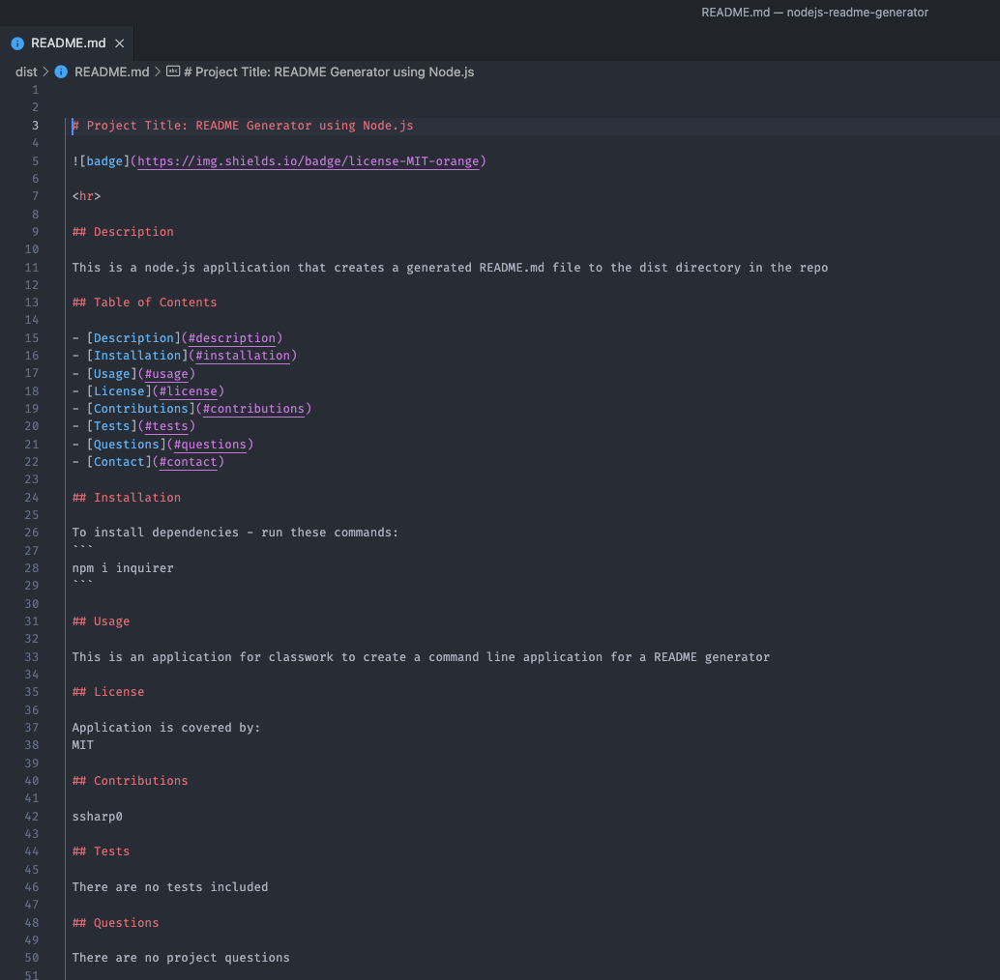
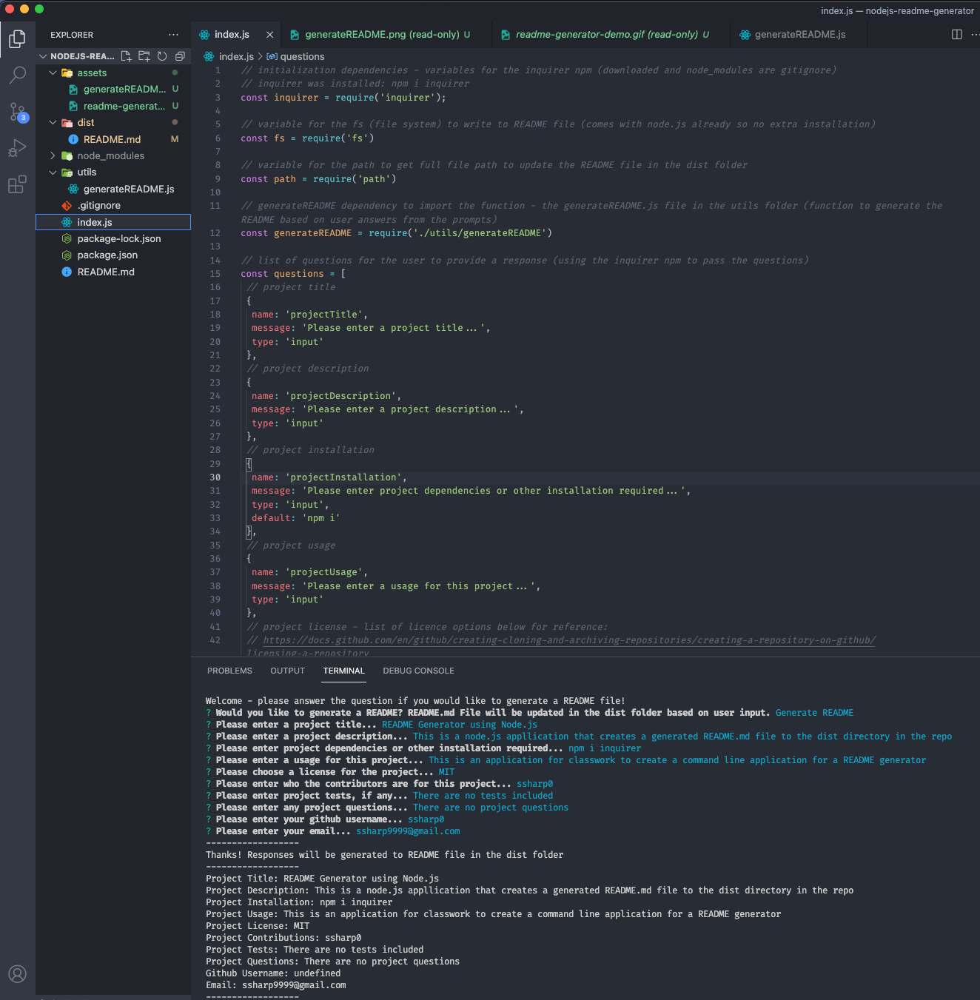

# nodejs-readme-generator
Readme Generator using node.js and npm (inquirer)

<p align="center">

<br>


</p>

### Demo Video: https://drive.google.com/file/d/1oQbV4JtNko9Kl-70clnKMuttg_v7IZDS/view?usp=sharing

## Description
A Node.js command-line based application where a user will be presented with a series of questions (in the terminal) to generate a README.md for their repository.

Example generated README.md is located in the 'dist' folder where the README.md file is generated.

Video demonstrating application functionality:


## Usage

This application allows a user to create a README.md after being asked a series of questions. 

This process is invoked with the following command in the project root: `node index.js` 

Note, the user would first need to download the npm package (terminal command: npm i) for inquirer npm in the project root. Node needs to be installed as well. Please see below links in technologies for additional information.

Once the command is run, the user will first be prompted if they would like to generate a README, and if so the users will be prompted to provide the following information to generate the README.md file:

```
- Project Title
- Project Description
- Project Installation
- Project Usage
- Project License
- Project Contributions
- Project Tests
- Project Questions
- Username (github)
- Email
```

The user will be able to choose from a list of license choices - which is also added as a badge on the newly generated README.md file. 

After all user input has been recieved, then the README.md file (located in the dist folder for demo) will be generated with all information added to the appropriate sections along with a table of contents. 

## Installation

`npm init -y`

`npm i inquirer`

## Screenshots






## Technologies

<p><a href="https://www.npmjs.com/package/inquirer">Inquirer.js</a></p>
<p><a href="https://www.npmjs.com">NPM</a></p>
<p><a href="https://nodejs.org/">Node.js</a></p>


## Contribution

ssharp0
https://github.com/ssharp0/nodejs-readme-generator


